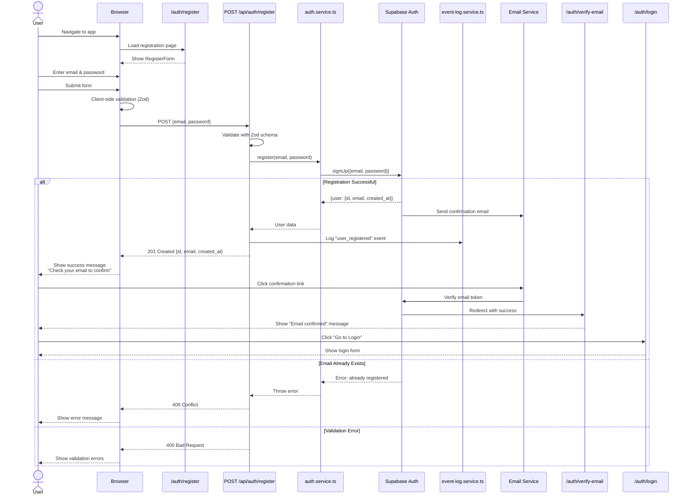
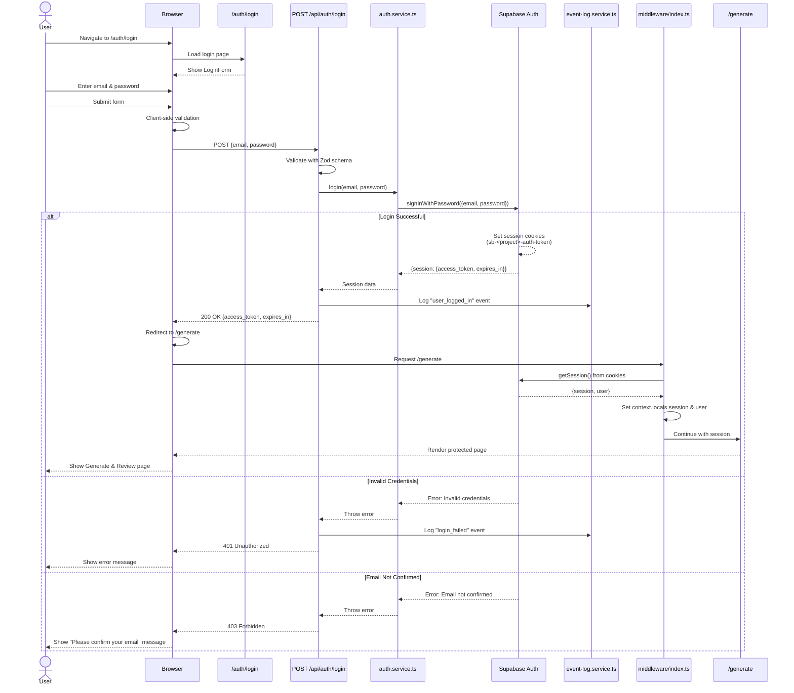
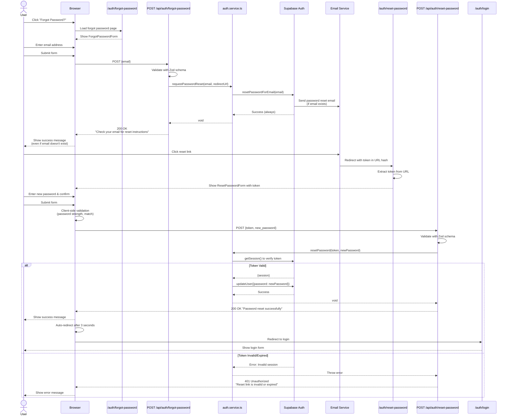
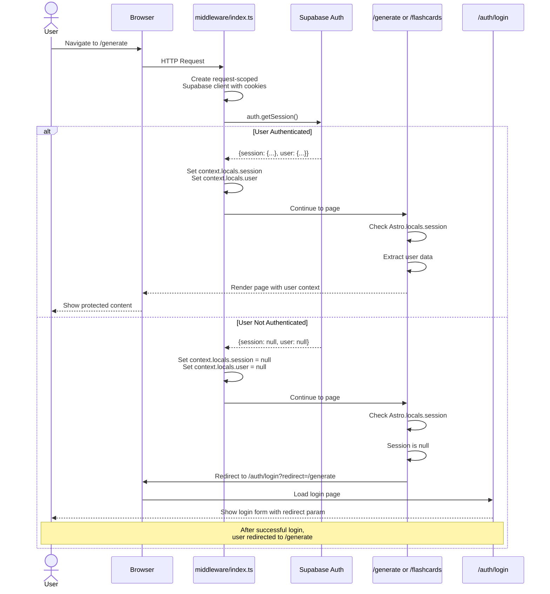
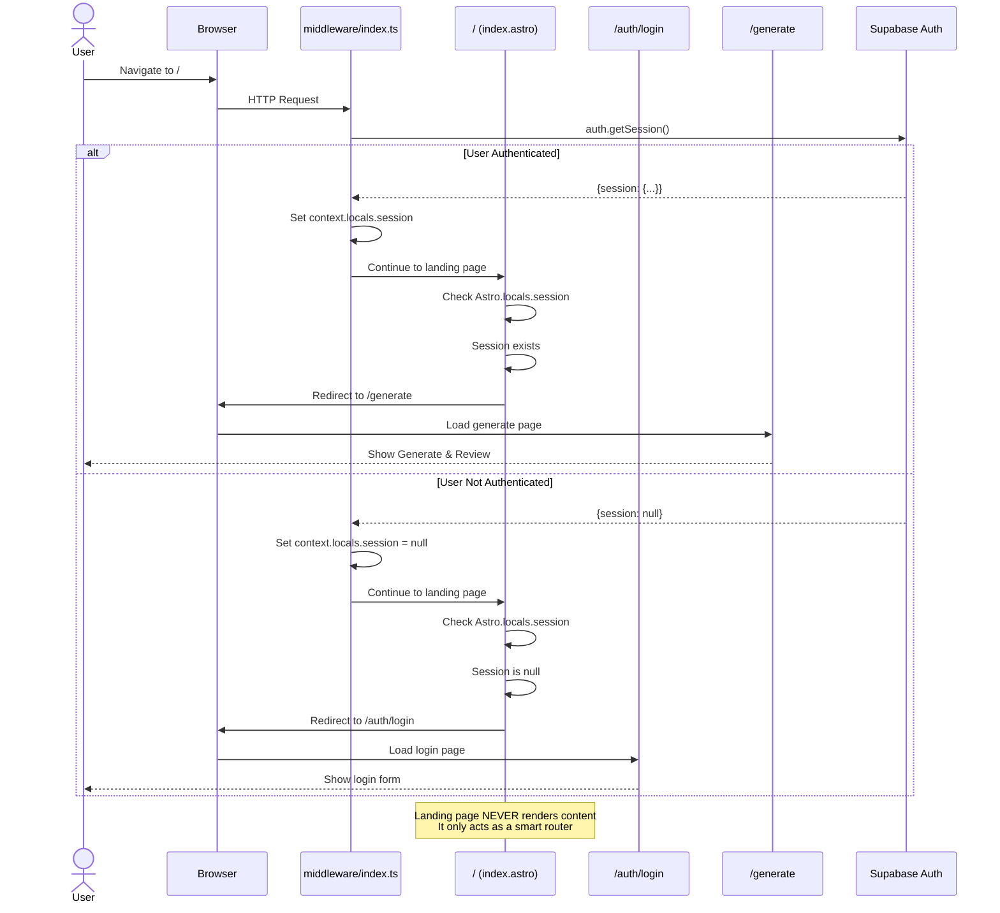
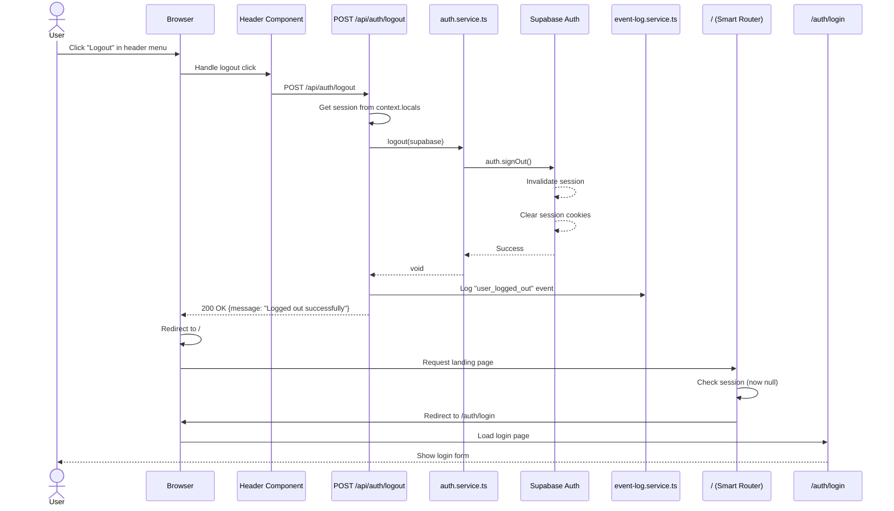
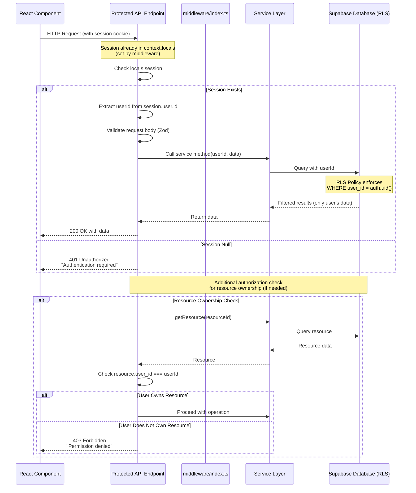
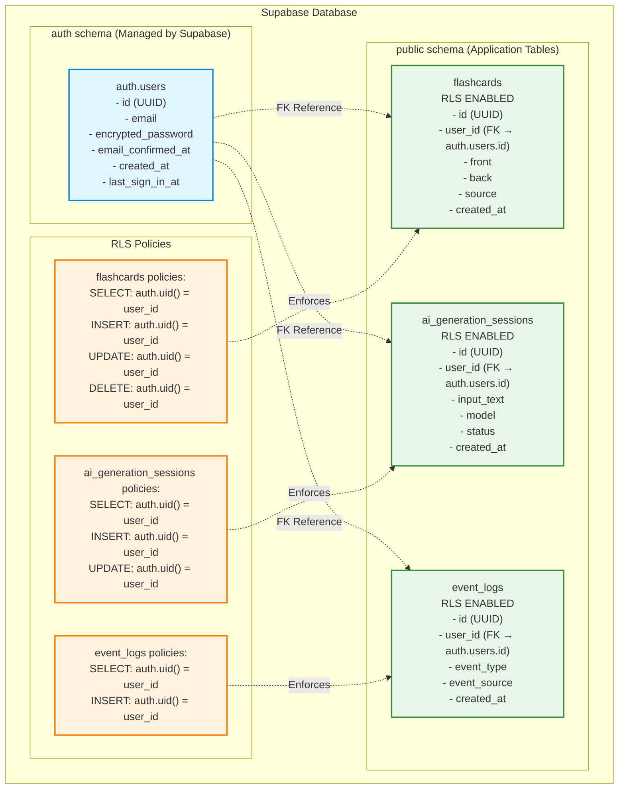
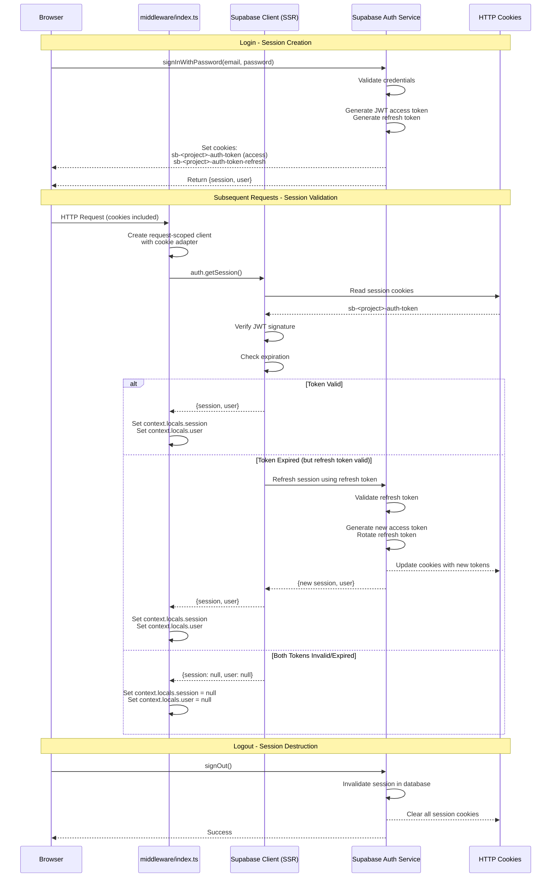

# Authentication Architecture Diagram - 10xCards

This diagram visualizes the complete authentication system architecture for 10xCards, including user flows, components, services, and database interactions.

## System Architecture Overview

```mermaid
graph TB
    subgraph "Client Layer"
        Browser[Browser]

        subgraph "Public Pages"
            Login["/auth/login<br/>LoginForm"]
            Register["/auth/register<br/>RegisterForm"]
            ForgotPwd["/auth/forgot-password<br/>ForgotPasswordForm"]
            ResetPwd["/auth/reset-password<br/>ResetPasswordForm"]
            VerifyEmail["/auth/verify-email"]
        end

        subgraph "Protected Pages"
            Landing["/index.astro<br/>(Smart Router)"]
            Generate["/generate<br/>GenerateReview"]
            Flashcards["/flashcards<br/>MyFlashcards"]
            Study["/study<br/>(Optional/Future)"]
        end

        subgraph "Layout Components"
            Header["Header<br/>(User Menu & Logout)"]
        end
    end

    subgraph "Middleware Layer"
        Middleware["middleware/index.ts<br/>- Create request-scoped Supabase client<br/>- Retrieve session from cookies<br/>- Inject session & user to context.locals"]
    end

    subgraph "API Layer"
        subgraph "Auth Endpoints (Public)"
            RegAPI["/api/auth/register<br/>POST"]
            LoginAPI["/api/auth/login<br/>POST"]
            LogoutAPI["/api/auth/logout<br/>POST"]
            ForgotAPI["/api/auth/forgot-password<br/>POST"]
            ResetAPI["/api/auth/reset-password<br/>POST"]
        end

        subgraph "Protected Endpoints"
            FlashcardsAPI["/api/flashcards<br/>GET, POST, DELETE"]
            FlashcardAPI["/api/flashcards/[id]<br/>GET, PUT, DELETE"]
            AISessionsAPI["/api/ai-sessions<br/>POST, GET"]
            CandidatesAPI["/api/ai-sessions/[id]/candidates<br/>GET"]
            ActionsAPI["/api/ai-sessions/[id]/candidates/actions<br/>POST"]
        end
    end

    subgraph "Service Layer"
        AuthService["auth.service.ts<br/>- register()<br/>- login()<br/>- logout()<br/>- requestPasswordReset()<br/>- resetPassword()<br/>- getSession()<br/>- refreshSession()"]

        FlashcardService["flashcards.service.ts<br/>(Existing)"]
        AIService["ai.service.ts<br/>(Existing)"]
        EventLogService["event-log.service.ts<br/>(Existing)"]

        AuthSchemas["auth.schemas.ts<br/>Zod Validation<br/>- registerSchema<br/>- loginSchema<br/>- forgotPasswordSchema<br/>- resetPasswordSchema"]
    end

    subgraph "External Services"
        SupabaseAuth["Supabase Auth<br/>- User Management<br/>- Email Sending<br/>- Token Generation<br/>- Session Management"]
        OpenRouter["OpenRouter API<br/>(AI Generation)"]
    end

    subgraph "Database Layer (Supabase)"
        AuthUsers["auth.users<br/>(Managed by Supabase)"]

        subgraph "Application Tables (RLS Enabled)"
            FlashcardsTable["flashcards<br/>RLS: user_id = auth.uid()"]
            AISessionsTable["ai_generation_sessions<br/>RLS: user_id = auth.uid()"]
            EventLogsTable["event_logs<br/>RLS: user_id = auth.uid()"]
        end
    end

    %% User Flow Connections
    Browser --> Login
    Browser --> Register
    Browser --> ForgotPwd
    Browser --> ResetPwd
    Browser --> Landing
    Browser --> Generate
    Browser --> Flashcards

    %% Middleware Connections
    Browser -.HTTP Request.-> Middleware
    Middleware -.Session Check.-> SupabaseAuth
    Middleware --> Landing
    Middleware --> Generate
    Middleware --> Flashcards

    %% Auth API Connections
    Login --> LoginAPI
    Register --> RegAPI
    ForgotPwd --> ForgotAPI
    ResetPwd --> ResetAPI
    Header --> LogoutAPI

    %% Protected API Connections
    Generate --> AISessionsAPI
    Generate --> CandidatesAPI
    Generate --> ActionsAPI
    Flashcards --> FlashcardsAPI
    Flashcards --> FlashcardAPI

    %% Service Layer Connections
    RegAPI --> AuthSchemas
    LoginAPI --> AuthSchemas
    ForgotAPI --> AuthSchemas
    ResetAPI --> AuthSchemas

    RegAPI --> AuthService
    LoginAPI --> AuthService
    LogoutAPI --> AuthService
    ForgotAPI --> AuthService
    ResetAPI --> AuthService

    FlashcardsAPI --> FlashcardService
    FlashcardAPI --> FlashcardService
    AISessionsAPI --> AIService
    CandidatesAPI --> AIService
    ActionsAPI --> AIService

    RegAPI --> EventLogService
    LoginAPI --> EventLogService
    LogoutAPI --> EventLogService

    %% External Service Connections
    AuthService --> SupabaseAuth
    AIService --> OpenRouter

    %% Database Connections
    SupabaseAuth --> AuthUsers
    FlashcardService --> FlashcardsTable
    AIService --> AISessionsTable
    EventLogService --> EventLogsTable

    %% Styling
    classDef publicPage fill:#e1f5ff,stroke:#0288d1,stroke-width:2px
    classDef protectedPage fill:#fff3e0,stroke:#f57c00,stroke-width:2px
    classDef authAPI fill:#f3e5f5,stroke:#7b1fa2,stroke-width:2px
    classDef protectedAPI fill:#fce4ec,stroke:#c2185b,stroke-width:2px
    classDef service fill:#e8f5e9,stroke:#388e3c,stroke-width:2px
    classDef external fill:#fff9c4,stroke:#f9a825,stroke-width:2px
    classDef database fill:#e0f2f1,stroke:#00796b,stroke-width:2px

    class Login,Register,ForgotPwd,ResetPwd,VerifyEmail publicPage
    class Landing,Generate,Flashcards,Study protectedPage
    class RegAPI,LoginAPI,LogoutAPI,ForgotAPI,ResetAPI authAPI
    class FlashcardsAPI,FlashcardAPI,AISessionsAPI,CandidatesAPI,ActionsAPI protectedAPI
    class AuthService,FlashcardService,AIService,EventLogService,AuthSchemas service
    class SupabaseAuth,OpenRouter external
    class AuthUsers,FlashcardsTable,AISessionsTable,EventLogsTable database
```



## User Registration Flow



## User Login Flow



## Password Reset Flow



## Protected Route Access Flow



## Landing Page Smart Router Flow



## Logout Flow



## API Endpoint Authentication Pattern



## Database Row-Level Security (RLS) Architecture



## Session Management & Cookie Flow



## Component & Service Dependencies

```mermaid
graph LR
    subgraph "React Components"
        LoginForm[LoginForm.tsx]
        RegisterForm[RegisterForm.tsx]
        ForgotPasswordForm[ForgotPasswordForm.tsx]
        ResetPasswordForm[ResetPasswordForm.tsx]
        PasswordStrength[PasswordStrengthIndicator.tsx]
        Header[Header.tsx]
        CreateFlashcardModal[CreateFlashcardModal.tsx]
    end

    subgraph "Astro Pages"
        LoginPage[/auth/login.astro]
        RegisterPage[/auth/register.astro]
        ForgotPage[/auth/forgot-password.astro]
        ResetPage[/auth/reset-password.astro]
        VerifyPage[/auth/verify-email.astro]
        IndexPage[/index.astro]
        GeneratePage[/generate/index.astro]
        FlashcardsPage[/flashcards/index.astro]
    end

    subgraph "API Endpoints"
        RegisterAPI[/api/auth/register.ts]
        LoginAPI[/api/auth/login.ts]
        LogoutAPI[/api/auth/logout.ts]
        ForgotAPI[/api/auth/forgot-password.ts]
        ResetAPI[/api/auth/reset-password.ts]
    end

    subgraph "Services"
        AuthService[auth.service.ts]
        AuthSchemas[auth.schemas.ts]
        EventLogService[event-log.service.ts]
    end

    subgraph "Shared UI"
        Button[ui/button.tsx]
        Input[ui/input.tsx]
        Alert[ui/alert-dialog.tsx]
        Dialog[ui/dialog.tsx]
    end

    %% Component Dependencies
    LoginPage --> LoginForm
    RegisterPage --> RegisterForm
    ForgotPage --> ForgotPasswordForm
    ResetPage --> ResetPasswordForm

    RegisterForm --> PasswordStrength
    ResetPasswordForm --> PasswordStrength

    LoginForm --> Button
    LoginForm --> Input
    LoginForm --> Alert
    RegisterForm --> Button
    RegisterForm --> Input
    RegisterForm --> Alert
    ForgotPasswordForm --> Button
    ForgotPasswordForm --> Input
    ResetPasswordForm --> Button
    ResetPasswordForm --> Input
    Header --> Dialog
    CreateFlashcardModal --> Dialog

    %% API Dependencies
    LoginForm -.POST.-> LoginAPI
    RegisterForm -.POST.-> RegisterAPI
    ForgotPasswordForm -.POST.-> ForgotAPI
    ResetPasswordForm -.POST.-> ResetAPI
    Header -.POST.-> LogoutAPI

    RegisterAPI --> AuthSchemas
    LoginAPI --> AuthSchemas
    ForgotAPI --> AuthSchemas
    ResetAPI --> AuthSchemas

    RegisterAPI --> AuthService
    LoginAPI --> AuthService
    LogoutAPI --> AuthService
    ForgotAPI --> AuthService
    ResetAPI --> AuthService

    RegisterAPI --> EventLogService
    LoginAPI --> EventLogService
    LogoutAPI --> EventLogService

    %% Styling
    classDef component fill:#e1f5ff,stroke:#0288d1,stroke-width:2px
    classDef page fill:#fff3e0,stroke:#f57c00,stroke-width:2px
    classDef api fill:#f3e5f5,stroke:#7b1fa2,stroke-width:2px
    classDef service fill:#e8f5e9,stroke:#388e3c,stroke-width:2px
    classDef ui fill:#fce4ec,stroke:#c2185b,stroke-width:2px

    class LoginForm,RegisterForm,ForgotPasswordForm,ResetPasswordForm,PasswordStrength,Header,CreateFlashcardModal component
    class LoginPage,RegisterPage,ForgotPage,ResetPage,VerifyPage,IndexPage,GeneratePage,FlashcardsPage page
    class RegisterAPI,LoginAPI,LogoutAPI,ForgotAPI,ResetAPI api
    class AuthService,AuthSchemas,EventLogService service
    class Button,Input,Alert,Dialog ui
```

## Implementation Status

| Component                    | Status                        | File Path                                            |
| ---------------------------- | ----------------------------- | ---------------------------------------------------- |
| **Backend**                  |                               |                                                      |
| Auth Service                 | ❌ Not Implemented            | `/src/lib/services/auth.service.ts`                  |
| Auth Schemas                 | ❌ Not Implemented            | `/src/lib/schemas/auth.schemas.ts`                   |
| Middleware (SSR)             | ⚠️ Partial (needs SSR client) | `/src/middleware/index.ts`                           |
| Register API                 | ❌ Not Implemented            | `/src/pages/api/auth/register.ts`                    |
| Login API                    | ❌ Not Implemented            | `/src/pages/api/auth/login.ts`                       |
| Logout API                   | ❌ Not Implemented            | `/src/pages/api/auth/logout.ts`                      |
| Forgot Password API          | ❌ Not Implemented            | `/src/pages/api/auth/forgot-password.ts`             |
| Reset Password API           | ❌ Not Implemented            | `/src/pages/api/auth/reset-password.ts`              |
| **Frontend**                 |                               |                                                      |
| LoginForm                    | ❌ Not Implemented            | `/src/components/auth/LoginForm.tsx`                 |
| RegisterForm                 | ❌ Not Implemented            | `/src/components/auth/RegisterForm.tsx`              |
| ForgotPasswordForm           | ❌ Not Implemented            | `/src/components/auth/ForgotPasswordForm.tsx`        |
| ResetPasswordForm            | ❌ Not Implemented            | `/src/components/auth/ResetPasswordForm.tsx`         |
| PasswordStrengthIndicator    | ❌ Not Implemented            | `/src/components/auth/PasswordStrengthIndicator.tsx` |
| Header Component             | ❌ Not Implemented            | `/src/components/layout/Header.tsx`                  |
| Login Page                   | ❌ Not Implemented            | `/src/pages/auth/login.astro`                        |
| Register Page                | ❌ Not Implemented            | `/src/pages/auth/register.astro`                     |
| Forgot Password Page         | ❌ Not Implemented            | `/src/pages/auth/forgot-password.astro`              |
| Reset Password Page          | ❌ Not Implemented            | `/src/pages/auth/reset-password.astro`               |
| Verify Email Page            | ❌ Not Implemented            | `/src/pages/auth/verify-email.astro`                 |
| Landing Page (Smart Router)  | ⚠️ Needs Update               | `/src/pages/index.astro`                             |
| Generate Page (Auth Guard)   | ⚠️ Needs Update               | `/src/pages/generate/index.astro`                    |
| Flashcards Page (Auth Guard) | ⚠️ Needs Update               | `/src/pages/flashcards/index.astro`                  |
| **Database**                 |                               |                                                      |
| Supabase Auth Config         | ❌ Not Configured             | Supabase Dashboard                                   |
| RLS Policies                 | ❌ Not Implemented            | Database Migration                                   |
| Email Templates              | ❌ Not Configured             | Supabase Dashboard                                   |

## Key Design Decisions

### 1. **Smart Router Pattern for Landing Page**

- Landing page (`/`) acts purely as a router
- No content is rendered
- Redirects based on authentication state:
  - Authenticated → `/generate`
  - Unauthenticated → `/auth/login`

### 2. **Request-Scoped Supabase Client**

- Uses `@supabase/ssr` package
- Creates client per request with cookie adapter
- Enables proper SSR session handling
- Automatically manages session cookies

### 3. **Cookie-Based Session Management**

- Supabase manages cookies automatically
- HttpOnly cookies prevent XSS attacks
- Secure flag in production
- SameSite=Lax for CSRF protection
- Automatic token refresh

### 4. **Row-Level Security (RLS)**

- Defense in depth security
- Database-level access control
- Automatic filtering by `user_id`
- Protects against SQL injection

### 5. **Middleware-Based Authentication**

- Session retrieved once per request
- Injected into `context.locals`
- Available in all pages and API endpoints
- Consistent authentication state

### 6. **Zod Validation**

- Shared schemas between client and server
- Type-safe validation
- Detailed error messages
- Consistent with existing codebase

### 7. **Event Logging**

- All authentication events logged
- Supports analytics and auditing
- No sensitive data logged

### 8. **Manual Flashcard Creation**

- Modal dialog on `/flashcards` page
- Triggered by "Create Flashcard" button
- Same validation as AI-generated cards
- Source marked as "manual"

## Security Features

1. **Password Security**
   - Minimum 8 characters
   - Complexity requirements (uppercase, lowercase, number, special)
   - Hashed by Supabase (bcrypt)
   - Never logged or exposed

2. **Token Security**
   - Short-lived access tokens (1 hour)
   - Long-lived refresh tokens (30 days)
   - Automatic token rotation
   - Single-use reset tokens

3. **Email Security**
   - Email confirmation required
   - Anti-enumeration protection
   - SPF/DKIM/DMARC configured

4. **Transport Security**
   - HTTPS enforced in production
   - Secure cookies
   - Security headers (CSP, HSTS, etc.)

5. **Authorization**
   - Session-based authentication
   - Resource ownership checks
   - Row-level security policies
   - No shared data between users

## Next Steps for Implementation

1. **Phase 1: Backend Foundation**
   - Create auth service and schemas
   - Update middleware with SSR client
   - Implement auth API endpoints
   - Configure Supabase Auth settings

2. **Phase 2: Frontend Components**
   - Create auth form components
   - Create auth pages
   - Update layout with Header
   - Add auth guards to protected pages

3. **Phase 3: Database & Security**
   - Enable RLS on all tables
   - Create RLS policies
   - Configure email templates
   - Test security measures

4. **Phase 4: Integration & Testing**
   - Update existing API endpoints
   - Remove DEFAULT_USER_ID
   - Test all user flows
   - Verify session management

5. **Phase 5: Deployment**
   - Configure production environment
   - Set up monitoring
   - Deploy and verify
   - Document for users
