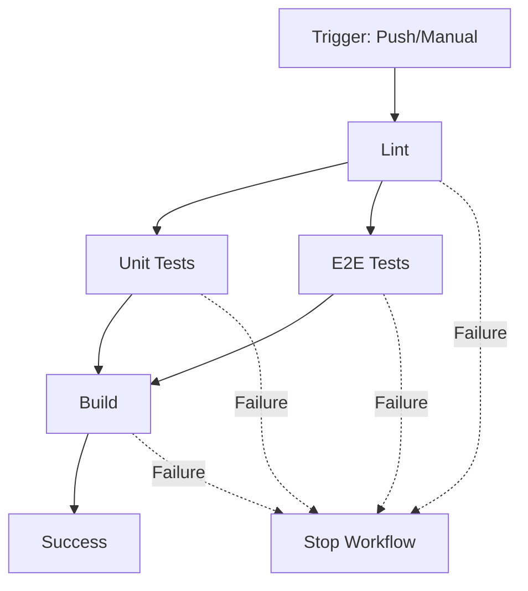

# CI/CD Workflow Diagram

## Complete Flow Visualization

```
┌──────────────────────────────────────────────────────────────────────┐
│                         TRIGGER EVENTS                               │
├──────────────────────────────────────────────────────────────────────┤
│                                                                      │
│  [Push to master]  ◄─────────────────────────┐                     │
│         │                                      │                     │
│         ▼                                      │                     │
│  Automatic Run                         [Manual Trigger]             │
│                                         (workflow_dispatch)          │
└──────────────────┬───────────────────────────┬───────────────────────┘
                   │                           │
                   └───────────┬───────────────┘
                               │
                               ▼
┌──────────────────────────────────────────────────────────────────────┐
│                        CONCURRENCY CONTROL                           │
├──────────────────────────────────────────────────────────────────────┤
│  • Cancel in-progress runs on new push                              │
│  • Group: ${{ github.workflow }}-${{ github.ref }}                  │
└──────────────────────────────┬───────────────────────────────────────┘
                               │
                               ▼
┌──────────────────────────────────────────────────────────────────────┐
│                            JOB 1: LINT                               │
├──────────────────────────────────────────────────────────────────────┤
│  Runner: ubuntu-latest                                               │
│  Node.js: 22.14.0 (from .nvmrc)                                     │
│  Cache: npm                                                          │
│                                                                      │
│  Steps:                                                              │
│  1. Checkout code                    [actions/checkout@v4]          │
│  2. Setup Node.js                    [actions/setup-node@v4]        │
│  3. Install dependencies             [npm ci]                       │
│  4. Run ESLint                       [npm run lint]                 │
│                                                                      │
│  Runtime: ~1-2 minutes                                              │
│  Artifacts: None                                                     │
│  On Failure: ❌ Blocks all downstream jobs                          │
└──────────────────────────────┬───────────────────────────────────────┘
                               │
                       ✅ Lint Passes
                               │
                   ┌───────────┴───────────┐
                   │                       │
                   ▼                       ▼
┌──────────────────────────────┐  ┌──────────────────────────────┐
│   JOB 2: UNIT TESTS          │  │   JOB 3: E2E TESTS           │
├──────────────────────────────┤  ├──────────────────────────────┤
│ Runner: ubuntu-latest        │  │ Runner: ubuntu-latest        │
│ Node.js: 22.14.0             │  │ Node.js: 22.14.0             │
│ Needs: lint                  │  │ Needs: lint                  │
│                              │  │ Env: CI=true                 │
│ Steps:                       │  │                              │
│ 1. Checkout code             │  │ Steps:                       │
│ 2. Setup Node.js             │  │ 1. Checkout code             │
│ 3. Install dependencies      │  │ 2. Setup Node.js             │
│ 4. Run unit tests            │  │ 3. Install dependencies      │
│    [npm test -- --run]       │  │ 4. Install Playwright        │
│ 5. Generate coverage         │  │    [chromium --with-deps]    │
│    [npm run test:coverage]   │  │ 5. Run E2E tests             │
│ 6. Upload coverage           │  │    [npm run test:e2e]        │
│    [always]                  │  │ 6. Upload Playwright report  │
│                              │  │    [always]                  │
│ Runtime: ~2-3 minutes        │  │ 7. Upload traces             │
│ Artifacts:                   │  │    [on failure only]         │
│ • Coverage (14 days)         │  │                              │
│                              │  │ Runtime: ~5-10 minutes       │
│ On Failure: ❌ Blocks build  │  │ Artifacts:                   │
└──────────────┬───────────────┘  │ • Playwright report (14d)    │
               │                  │ • Test traces (7d)           │
               │                  │                              │
               │                  │ On Failure: ❌ Blocks build  │
               │                  └──────────────┬───────────────┘
               │                                 │
               └────────────┬────────────────────┘
                            │
                    ✅ Both Tests Pass
                            │
                            ▼
┌──────────────────────────────────────────────────────────────────────┐
│                        JOB 4: BUILD                                  │
├──────────────────────────────────────────────────────────────────────┤
│  Runner: ubuntu-latest                                               │
│  Node.js: 22.14.0 (from .nvmrc)                                     │
│  Needs: [unit-tests, e2e-tests]                                     │
│                                                                      │
│  Steps:                                                              │
│  1. Checkout code                    [actions/checkout@v4]          │
│  2. Setup Node.js                    [actions/setup-node@v4]        │
│  3. Install dependencies             [npm ci]                       │
│  4. Build production                 [npm run build]                │
│  5. Upload build artifacts           [actions/upload-artifact@v4]   │
│                                                                      │
│  Runtime: ~2-4 minutes                                              │
│  Artifacts: Production build (dist/) - 7 days retention             │
│  On Failure: ❌ No deployable artifact                              │
└──────────────────────────────┬───────────────────────────────────────┘
                               │
                       ✅ Build Succeeds
                               │
                               ▼
┌──────────────────────────────────────────────────────────────────────┐
│                         ✅ WORKFLOW COMPLETE                         │
├──────────────────────────────────────────────────────────────────────┤
│  Total Runtime: ~10-15 minutes                                      │
│                                                                      │
│  Artifacts Available:                                                │
│  📊 Coverage Report      (14 days)                                  │
│  🎭 Playwright Report    (14 days)                                  │
│  🔍 Test Traces          (7 days, if tests failed)                  │
│  📦 Production Build     (7 days)                                   │
│                                                                      │
│  Next Steps:                                                         │
│  • Download artifacts for review                                    │
│  • Deploy dist/ to production (manual)                              │
│  • Monitor application performance                                  │
└──────────────────────────────────────────────────────────────────────┘
```

## Job Execution Timeline

```
Time    │ Lint       │ Unit Tests │ E2E Tests  │ Build      │
────────┼────────────┼────────────┼────────────┼────────────┤
0:00    │ ▓▓▓▓       │            │            │            │
1:00    │ ▓▓▓▓       │            │            │            │
2:00    │ ✅         │ ▓▓▓▓▓      │ ▓▓▓▓▓      │            │
3:00    │            │ ▓▓▓▓▓      │ ▓▓▓▓▓      │            │
4:00    │            │ ▓▓▓▓▓      │ ▓▓▓▓▓      │            │
5:00    │            │ ✅         │ ▓▓▓▓▓      │            │
6:00    │            │            │ ▓▓▓▓▓      │            │
7:00    │            │            │ ▓▓▓▓▓      │            │
8:00    │            │            │ ▓▓▓▓▓      │            │
9:00    │            │            │ ▓▓▓▓▓      │            │
10:00   │            │            │ ▓▓▓▓▓      │            │
11:00   │            │            │ ▓▓▓▓▓      │            │
12:00   │            │            │ ✅         │ ▓▓▓▓▓▓     │
13:00   │            │            │            │ ▓▓▓▓▓▓     │
14:00   │            │            │            │ ▓▓▓▓▓▓     │
15:00   │            │            │            │ ✅         │
────────┴────────────┴────────────┴────────────┴────────────┘
        ▓ = Running
        ✅ = Complete
```

## Parallel Execution Strategy

```
                    Lint
                     │
        ┌────────────┼────────────┐
        │                         │
   Unit Tests                E2E Tests
   (Parallel)                (Parallel)
        │                         │
        └────────────┬────────────┘
                     │
                   Build
                (Sequential)
```

**Optimization**: Unit and E2E tests run in parallel after lint passes, saving ~5-10 minutes compared to sequential execution.

## Dependency Graph



## Artifact Flow

```
Unit Tests ──► Coverage Report ──► Upload to GitHub
                (HTML/LCOV)         (14 days)

E2E Tests  ──► Playwright Report ──► Upload to GitHub
                (HTML)                (14 days)
           └──► Test Traces ──────► Upload on Failure
                (Screenshots/Videos)  (7 days)

Build ─────► dist/ Folder ────────► Upload to GitHub
                (Static files)        (7 days)
```

## Caching Strategy

```
First Run:
┌──────────────┐
│ npm ci       │
│ Downloads    │  ──► Cache created
│ 2-3 minutes  │      ~/.npm
└──────────────┘

Subsequent Runs:
┌──────────────┐
│ npm ci       │
│ Uses cache   │  ◄── Cache restored
│ 30-60 sec    │      ~/.npm
└──────────────┘
```

**Time Saved**: ~2 minutes per job × 4 jobs = **~8 minutes saved** on cached runs

## Node.js Setup Flow

```
.nvmrc File
    │
    ├─► Contains: 22.14.0
    │
    ▼
actions/setup-node@v4
    │
    ├─► Reads .nvmrc
    ├─► Installs Node.js 22.14.0
    ├─► Sets up npm cache
    │
    ▼
All jobs use consistent Node.js version ✅
```

## Failure Handling

```
Any Job Fails
    │
    ├─► Artifact uploads continue (if configured)
    ├─► Downstream jobs are skipped
    ├─► Workflow marked as failed ❌
    │
    ▼
Developer Actions:
    ├─► Download artifacts
    ├─► Review logs
    ├─► Fix locally
    ├─► Push fix
    └─► Workflow re-runs automatically
```

## Success Path

```
Push to master
    ↓
✅ Lint passes (2 min)
    ↓
✅ Unit tests pass (3 min)
✅ E2E tests pass (10 min)  ← Parallel
    ↓
✅ Build succeeds (3 min)
    ↓
📦 Artifacts uploaded
    ↓
🎉 Ready for deployment
```

## Key Metrics

| Metric | Value |
|--------|-------|
| **Total Jobs** | 4 |
| **Parallel Jobs** | 2 (Unit + E2E) |
| **Sequential Jobs** | 2 (Lint → Build) |
| **Total Runtime** | ~10-15 minutes |
| **Optimized Runtime** | Yes (8 min saved via caching) |
| **Artifact Size** | ~30-70 MB total |
| **Retention Cost** | Negligible (GitHub Free) |
| **CI Minutes/Run** | ~15 minutes |
| **Runs/Month** | ~133 on free tier |

## Trigger Comparison

| Trigger Type | When | Use Case |
|-------------|------|----------|
| **Push to master** | Automatic | Normal development flow |
| **Manual (workflow_dispatch)** | On-demand | Testing, debugging, demos |

## Environment Isolation

```
Job: Lint
├─► Fresh Ubuntu container
├─► Node.js 22.14.0
├─► npm dependencies
└─► Isolated from other jobs

Job: Unit Tests
├─► Fresh Ubuntu container
├─► Node.js 22.14.0
├─► npm dependencies
└─► Isolated from other jobs

Job: E2E Tests
├─► Fresh Ubuntu container
├─► Node.js 22.14.0
├─► npm dependencies
├─► Chromium browser + deps
└─► Isolated from other jobs

Job: Build
├─► Fresh Ubuntu container
├─► Node.js 22.14.0
├─► npm dependencies
└─► Isolated from other jobs
```

**Each job runs in a clean environment** → No side effects or state pollution ✅

---

**Legend**:
- ✅ Success
- ❌ Failure
- ▓ Running
- ──► Flow
- ├─► Step
- └─► Final step

