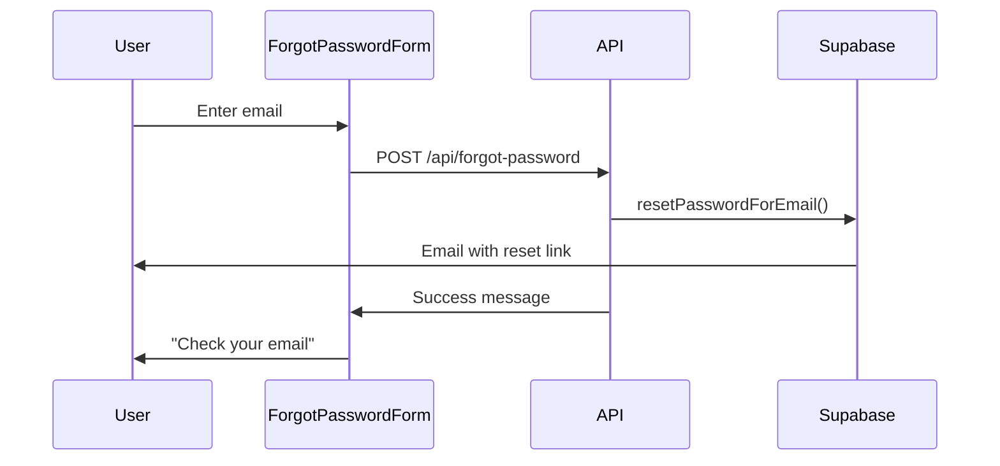
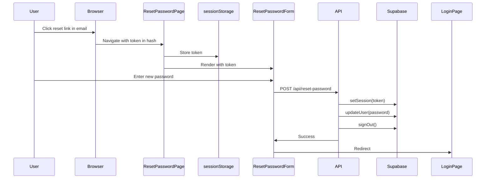

# Password Reset Implementation

This document describes the complete password reset flow implementation for 10xCards, following Supabase authentication patterns and maintaining consistency with the existing login implementation.

## Overview

The password reset functionality consists of two main flows:

1. **Forgot Password Flow**: User requests a password reset link
2. **Reset Password Flow**: User sets a new password using the link from their email

## Architecture

### Components

- **ForgotPasswordForm** (`src/components/auth/ForgotPasswordForm.tsx`)
  - Handles password reset request
  - Validates email input
  - Calls `/api/forgot-password` endpoint
  - Shows success message without revealing if email exists (security)

- **ResetPasswordForm** (`src/components/auth/ResetPasswordForm.tsx`)
  - Extracts access token from URL hash
  - Validates new password with strength requirements
  - Calls `/api/reset-password` endpoint
  - Redirects to login after successful reset

### API Endpoints

- **POST /api/forgot-password** (`src/pages/api/forgot-password.ts`)
  - Validates email using Zod schema
  - Calls `authService.requestPasswordReset()`
  - Always returns success (prevents email enumeration)
  - Sends email with reset link to `/reset-password`

- **POST /api/reset-password** (`src/pages/api/reset-password.ts`)
  - Validates token and new password using Zod schema
  - Establishes temporary session with token
  - Calls `authService.resetPassword()`
  - Logs password reset event
  - Signs out user (requires login with new password)

### Pages

- **Forgot Password Page** (`src/pages/forgot-password.astro`)
  - Server-rendered page
  - Redirects authenticated users to `/generate`
  - Renders `ForgotPasswordForm` component

- **Reset Password Page** (`src/pages/reset-password.astro`)
  - Server-rendered page
  - Extracts token from URL hash using client-side script
  - Stores token in sessionStorage
  - Renders `ResetPasswordForm` component

## Complete User Flow

### 1. Request Password Reset



**Steps:**

1. User navigates to `/forgot-password`
2. User enters their email address
3. Form validates email format client-side
4. Form submits to `/api/forgot-password`
5. API calls `authService.requestPasswordReset()`
6. Supabase sends email with link: `{SITE_URL}/reset-password#access_token=...`
7. API returns success message (always, even if email doesn't exist)
8. User sees "Check your email" message

### 2. Reset Password



**Steps:**

1. User clicks reset link in email
2. Browser navigates to `/reset-password#access_token=...&type=recovery`
3. Page script extracts token from URL hash
4. Token stored in sessionStorage
5. ResetPasswordForm component loads
6. Component retrieves token from sessionStorage
7. User enters new password (with strength validation)
8. Form submits to `/api/reset-password` with token and new password
9. API validates token by creating temporary session
10. API updates password via `authService.resetPassword()`
11. API logs password reset event
12. API signs out user
13. User redirected to `/login` with success message
14. User logs in with new password

## Security Features

### Email Enumeration Prevention

The forgot password endpoint always returns success, regardless of whether the email exists:

```typescript
// Always return success to prevent email enumeration
return new Response(
  JSON.stringify({
    message: "If an account exists with this email, you will receive password reset instructions",
  }),
  { status: 200 }
);
```

### Token Validation

The reset password endpoint validates the token by establishing a session:

```typescript
const { data: sessionData, error: sessionError } = await supabase.auth.setSession({
  access_token: token,
  refresh_token: token,
});

if (sessionError || !sessionData.session) {
  return errorResponse(401, "Invalid or expired reset token");
}
```

### Password Strength Requirements

New passwords must meet these requirements (enforced by Zod schema):

- Minimum 8 characters
- Maximum 72 characters
- At least one uppercase letter
- At least one lowercase letter
- At least one number
- At least one special character (!@#$%^&\*)

### Forced Re-authentication

After password reset, the user is signed out and must log in with their new password:

```typescript
// Sign out the user after password reset
await supabase.auth.signOut();
```

## Error Handling

### Client-Side Validation

Both forms validate input before submission:

- Email format validation
- Password strength validation
- Confirm password matching

### Server-Side Validation

API endpoints use Zod schemas for validation:

- `forgotPasswordSchema` - validates email
- `resetPasswordSchema` - validates token and new password

### User-Friendly Error Messages

Specific error messages for common scenarios:

- "Invalid or expired reset token"
- "New password must be different from your old password"
- "Password must contain at least one uppercase letter"
- etc.

## Consistency with Login Implementation

The implementation follows the same patterns as the login flow:

1. **API Structure**: Same error handling, validation, and response format
2. **Form Components**: Similar validation logic, loading states, and error display
3. **Service Layer**: Uses `authService` methods consistently
4. **Event Logging**: Logs password reset events like login events
5. **Middleware**: Both forgot and reset endpoints are public paths

## Environment Variables

Required environment variables (defined in `src/env.d.ts`):

```typescript
interface ImportMetaEnv {
  readonly SUPABASE_URL: string;
  readonly SUPABASE_KEY: string;
  readonly PUBLIC_SITE_URL: string; // Used for reset link redirect
}
```

## Testing Checklist

### Forgot Password Flow

- [ ] Valid email shows success message
- [ ] Invalid email format shows validation error
- [ ] Non-existent email still shows success (no enumeration)
- [ ] Email is received with reset link
- [ ] Reset link contains access_token in hash

### Reset Password Flow

- [ ] Valid token allows password reset
- [ ] Expired token shows error
- [ ] Invalid token shows error
- [ ] Password strength validation works
- [ ] Confirm password matching works
- [ ] Success redirects to login
- [ ] User can log in with new password
- [ ] Old password no longer works

### Security

- [ ] Email enumeration prevented
- [ ] Token expires after use
- [ ] User is signed out after reset
- [ ] Password strength requirements enforced
- [ ] Same password as old rejected

## Future Enhancements

Potential improvements:

1. Rate limiting on forgot password endpoint
2. Password reset attempt tracking
3. Email notification when password is changed
4. Password history (prevent reuse of recent passwords)
5. Two-factor authentication for password reset


